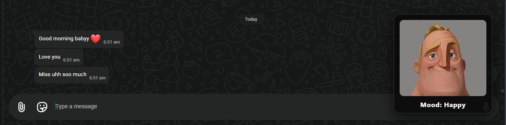
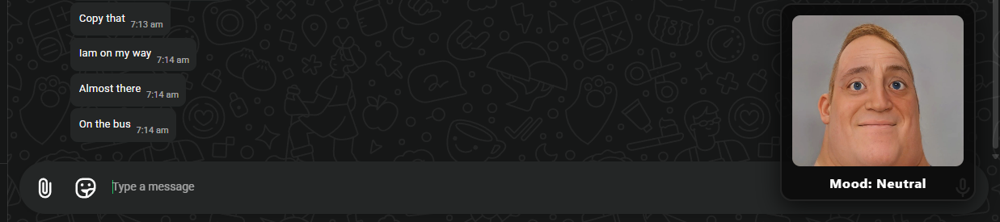
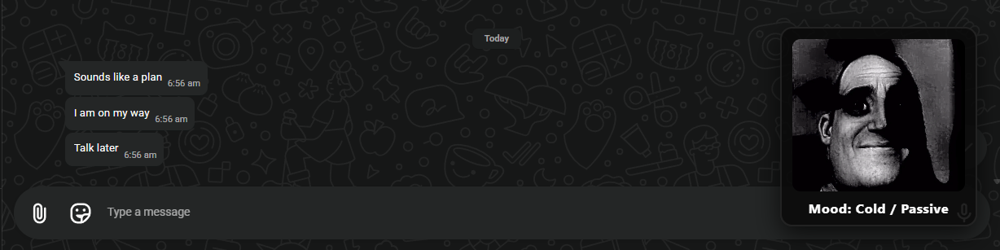
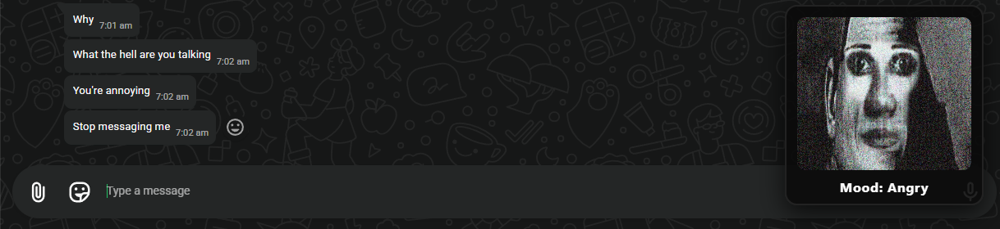
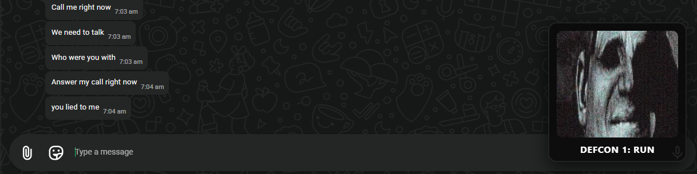

# Girlfriend Becoming Uncanny 🎯

## Basic Details
### Team Name: Null Pointers

### Team Members
- Team Lead: Akshay Ashok - NSS College Of Engineering, Palakkad
- Member 2: Adhithya K B - NSS College Of Engineering, Palakkad

### Project Description
A Chrome extension for WhatsApp Web that displays a real-time "Mr. Incredible Becoming Uncanny" visual indicator reflecting the sentiment of incoming messages from your partner.

### The Problem 
Text messages lack tone of voice, making it impossible to know if a simple "k" or "fine" means everything is okay or if you should start looking for emergency shelter immediately.

### The Solution 
A geometric DOM-scraping extension that evaluates incoming WhatsApp message sentiment and visually morphs Mr. Incredible through 5 levels of distress—from Phase 1 (Happy) to Phase 5 (DEFCON 1 Crisis)—right inside your browser tab.

## Technical Details
### Technologies/Components Used
For Software:
- Languages: JavaScript, HTML5, CSS3
- APIs/Frameworks: Chrome Extension APIs (Manifest v3)
- Methods/Algorithms: Geometric Layout Bounding (`getBoundingClientRect`), Real-time DOM Querying, Keyphrase Pattern Matching Dictionary

### Implementation
For Software:
# Installation
1. **Clone or Download the Repository:**
   git clone [https://github.com/your-username/girlfriend-becoming-uncanny.git](https://github.com/your-username/girlfriend-becoming-uncanny.git)
2. **Open Chrome Extension Management:**
        In Google Chrome, go to chrome://extensions/
        Enable Developer mode using the toggle switch in the top-right corner.
3. **Load the Unpacked Extension:**
        Click Load unpacked in the top-left corner.
        Select the directory containing manifest.json, content.js, and the phase*.png assets

### Project Documentation

# Screenshots
Happy Phase: "Living in blissful ignorance — zero red flags detected."

Neutral Phase: "Standard logistical banter — all systems normal."

Cold Phase: "She sent 'k.' — emergency protocols initiated."

Angry Phase: "Distress level critical — drop everything and apologize."

DEFCON1 Run Phase: "DEFCON 1: Delete game, pack bags, answer immediately."

### Project Demo
# Video
https://drive.google.com/file/d/1OpPDwPoOsIMSKhI5DDjTMPa4989cmpVs/view?usp=sharing

Girlfriend Becoming Uncanny is a local Chrome extension for WhatsApp Web that decodes the hidden tone of incoming messages in real time. Using DOM-scraping and an offline keyphrase engine, it dynamically morphs a floating Mr. Incredible widget through 5 levels of distress—from Phase 1 (Happy) all the way to Phase 5 (DEFCON 1 Crisis)—giving you an immediate visual warning when a simple "k" actually means trouble. Built for TinkerHub Useless Projects 3.0 by Team Null Pointers.

---
Made with ❤️ at TinkerHub Useless Projects 

